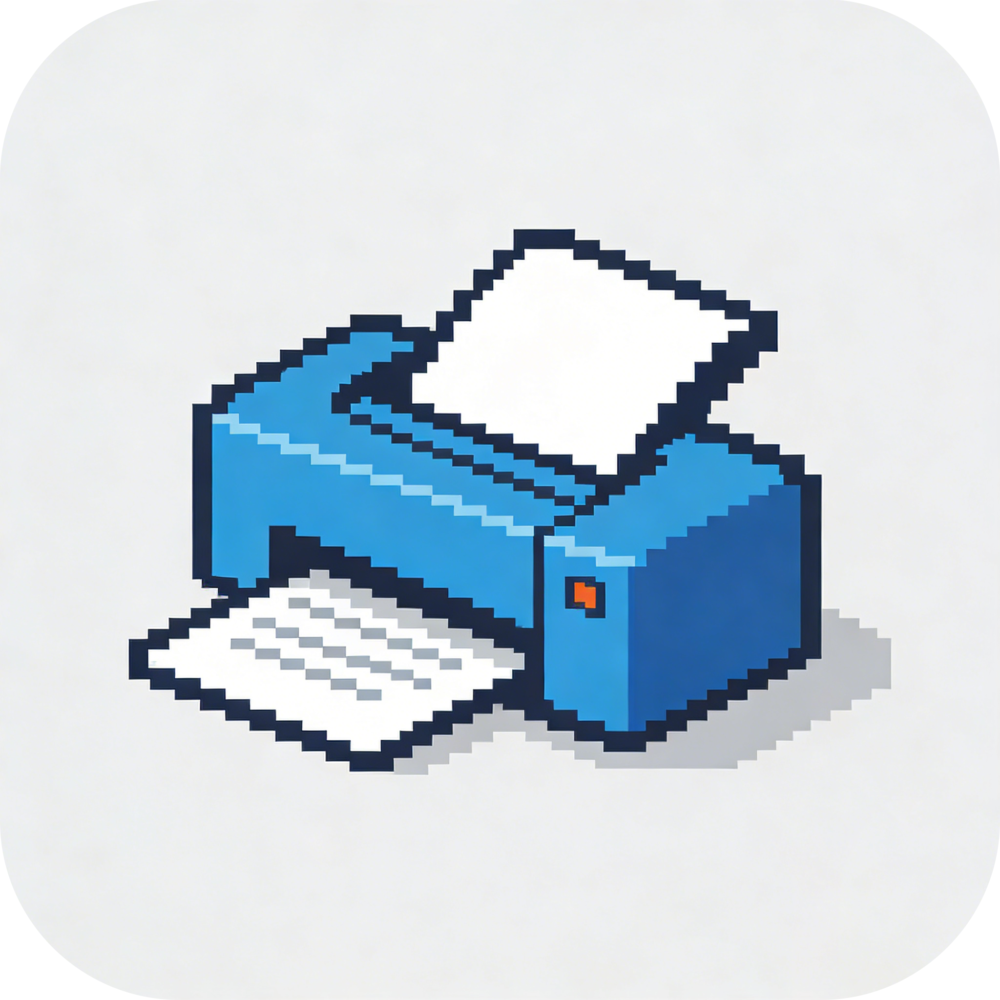
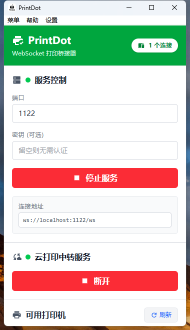
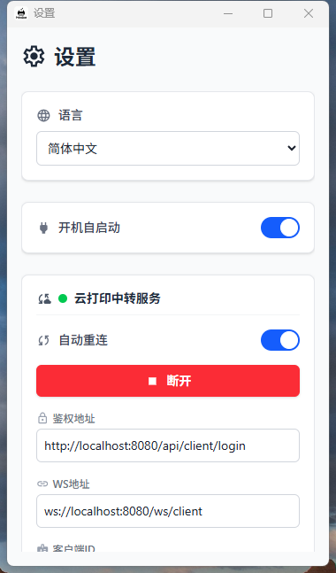

<div align="center">

# PrintDot Client

[中文](README.md) | **English**



</div>

## Introduction

PrintDot Client is a desktop printing assistant built with Wails and Vue, focusing on "stability, speed, and ease of use". It packages device discovery, connection management, and forwarding capabilities into a lightweight client, allowing you to achieve higher printing stability and availability with less configuration effort. This project is the companion client for [Vue Print Designer](https://github.com/0ldFive/Vue-Print-Designer).

## Screenshots

<table>
  <tr>
    <td align="center">
      <br />
      <em>Main Interface - Device Status & Connection Management</em>
    </td>
    <td align="center">
      <br />
      <em>Settings Page - Preferences & Configuration</em>
    </td>
  </tr>
</table>

## Advantages

- Instant startup and response, virtually zero wait for daily operations
- Stable and reliable discovery and forwarding, worry-free for long-term running
- Consistent cross-platform experience, less hassle from environment differences
- Lightweight architecture with low resource usage, runs smoothly even on older machines
- Polished settings and multilingual experience, easier for beginners
- Modern interface with clear information hierarchy, key status visible at a glance

## Supported Platforms

- Windows
- macOS
- Linux

## Features

- Auto-discovery and identification of local/network devices
- Stable connection maintenance and forwarding queue
- Clean visual status and alert notifications
- Multilingual interface and basic preferences
- Lightweight mode suitable for long-term background running

## Architecture & Modules

- Frontend: Vue 3 + Vite + Tailwind for UI and interactions
- Desktop Container: Wails for cross-platform windowing and system capabilities
- Backend: Go service layer for discovery, connection, forwarding, and configuration

## Installation & Usage

### Development Mode

1. Install Wails and Node.js dependencies
2. Run the development command

```bash
wails dev
```

### Production Build

```bash
wails build
```

#### Windows

```bash
wails build -clean -nsis
```

#### macOS

```bash
wails build -clean -platform darwin/amd64
wails build -clean -platform darwin/arm64
```

#### Linux

```bash
wails build -clean -platform linux/amd64
```

## Configuration

- Configuration files are automatically generated and maintained by the application
- Device and forwarding options can be adjusted in the settings page
- Changes take effect immediately without restart

## FAQ

**Q: What if the device doesn't appear or the connection is unstable?**

- Check if devices are on the same network and firewall is properly configured
- Restart the client and rediscover
- If issues persist, refer to the user manual for troubleshooting

**Q: Does it support running in background?**

- Yes, the application is optimized for low resource usage and continuous forwarding

## Contributing

- Issues and Pull Requests are welcome
- Please read the user manual and configuration guide first to maintain consistent behavior and experience

## User Manual

- 中文: [docs/usage_guide_zh.md](docs/usage_guide_zh.md)
- English: [docs/usage_guide_en.md](docs/usage_guide_en.md)
